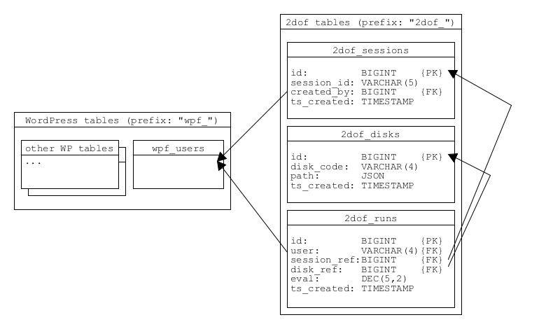

# 2dof Database

## Create tables
The tables for 2dof have to be created inside of the WordPress database because some foreign keys reference the WordPress users.

Run the scripts inside the .sql files on the WordPress database in the order given. This will create all the tables, triggers and functions. `05_seeds.sql` is optional to create dummy data. Read the note in `04_events.sql`.

_If a script fails, you may need to split it into the individual tables/functions._